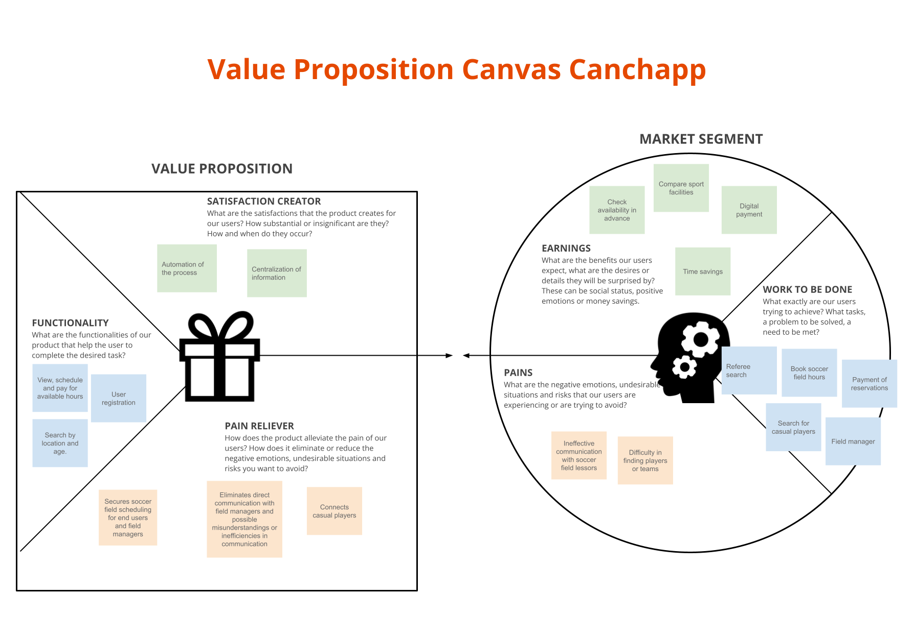
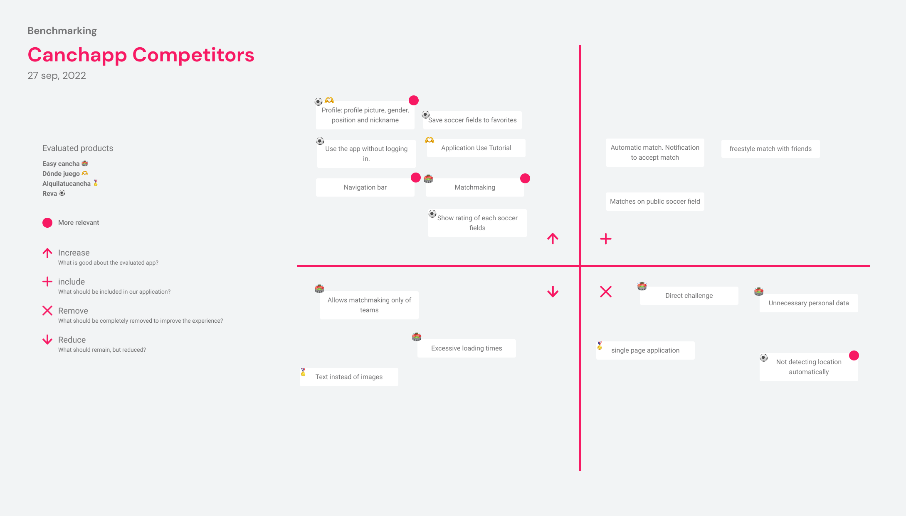
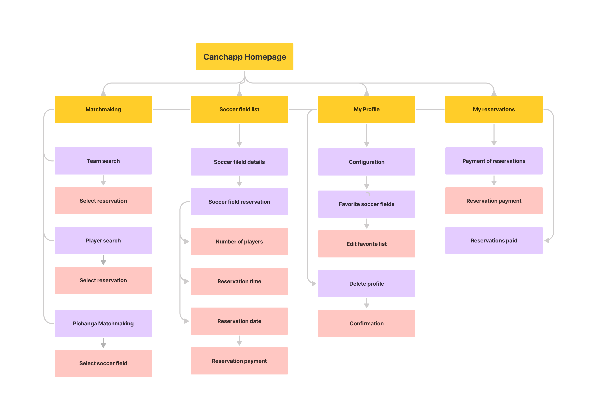

# Canchapp UXD
User experience design process for Canchapp - Book sports venues and invite your friends to play in one place

## Index
- [Description](#description)
- [Strategy](#strategy)
- [Scope](#scope) (UPDATED)
- [Structure](#structure)
- [Skeleton](#skeleton)
- [Surface](#surface)
- [Usability and accessibility](#usability-and-accessibility) (NEW)
- [Authors and acknowledgment](#authors-and-acknowledgment)

---

## Description
The purpose of this project is to be an educational and application instance of user experience design learning.

The problem to be solved is the decentralization and difficult access to sports venues rental that recurrent
users of these places suffer, having to use different tools for payment, communication, etc., in order to access to the services. 
Since this project corresponds exclusively to user experience design and its elements, the strategy, scope, structure, skeleton and surface are described in this document.
All of the above is focused on a mobile application for casual soccer players.

---

## Strategy
The first step undertaken by the team is to articulate the strategy. A "Value Proposition Canvas" is used as a way to compare canchapp and the potential solution to the customer's need.



This process led us to understand our market segment and relate it to a value-adding proposition. From the previous figure it is worth indicating some elements observed such as "Payment of reservations" and its counterpart in "Functionality", "View, schedule, and pay for available hours" this allows us to better understand our product in the terms described above. There are also other elements that were of initial consideration such as the search for referees, which would eventually be discarded by the team.

---

## Scope
After defining a product strategy it is important to define a scope. In this section we create a profile of our ideal customer and visualize how our product will work for them.


According to the UX Persona we define the customer journey map as a projection of what is going to happen during the usage of the app.


We define how to meet the strategic objectives defined in the previous section. These are converted into requirements through the benchmark canvas.

[Benchmark canvas: Full document here](deliverables/BenchmarkCanvas.pdf)


---

## Structure


---

## Skeleton
Wireframes
- [Full document here](deliverables/Wireframes.pdf)

---

## Surface

Mockups
- [Full document here](deliverables/Mockups.pdf)

---

## Usability and accessibility
As part of the user experience design process for Canchapp, improvements have been applied during a second design phase. The results and issues to consider are described in this section.

### Usability evaluation
This section reports the heuristic evaluation process applied by the user experience development team for the approach of a soccer field reservation application towards its counterpart (Canchapp).

This evaluation consists of a usability inspection method that allows to inspect the quality of use of the proposed interface.

From this the team that evaluates takes in consideration a set of observed problems and then make a identification of the most severe and critical problems. Canchapp team addressed the problems through the solutions suggested or actively discussing them. The resultant product can be viewed [here]("deliverables/MockupsImprovements.pdf")

The specific problems addressed in this section are as follows:
```
- Added field quotas
- Fixed redundant drawer
    - Drawer is deleted
    - Added favorites button to navbar
    - Move options to settings tab
    - Drawer open button replaced by options button
```

### Accessibility
- Added the next accessibility options:
    - Font size
    - Page contrast
- Added feedback and help to handle bugs in registration screen.
- Added gradient to images to improve text readability

---

## Authors and acknowledgment
- [Francisca Rivas](https://github.com/PanchiAnubis) - Designer
- [Esteban Esparza](https://github.com/Esteb4nx) - Designer
- [Gabriel Aillapán](https://github.com/GabeASM) - Analyst
- [Jorge Mainhard](https://github.com/jmainhard) - Project Manager

