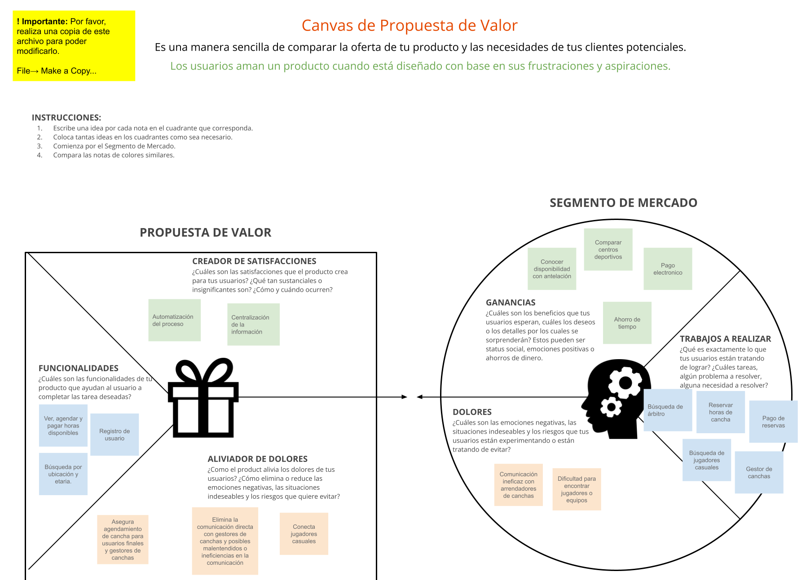
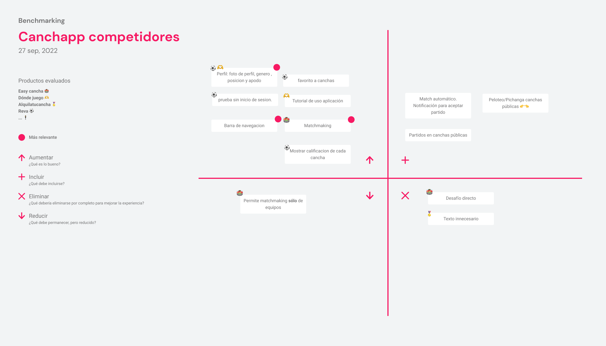

# Canchapp UXD
User experience design process for Canchapp - Book sports venues and invite your friends to play in one place

## Authors and acknowledgment
- [Francisca Rivas](https://github.com/PanchiAnubis) - Designer
- [Esteban Esparza](https://github.com/Esteb4nx) - Designer
- [Gabriel Aillapán](https://github.com/GabeASM) - Analyst
- [Jorge Mainhard](https://github.com/jmainhard) - Project Manager

## Description
The purpose of this project is to be an educational and application instance of user experience design learning. The problem to be solved is the decentralization and difficult access to sports venues rental that recurrent users of these places suffer, having to use different tools for payment, communication, etc., in order to access to the services. Since this project corresponds exclusively to user experience design and its elements, the strategy, scope, structure, skeleton and surface are described in this document. All of the above is focused on a mobile application for casual users in the sport of soccer.
___

## Strategy [TODO: WRITE, ORDER, AND REMOVE YELLOW POST-IT]

## Scope [WORK IN PROGRESS]

## Structure [WORK IN PROGRESS]

## Skeleton [WORK IN PROGRESS]

## Surface [WORK IN PROGRESS]

